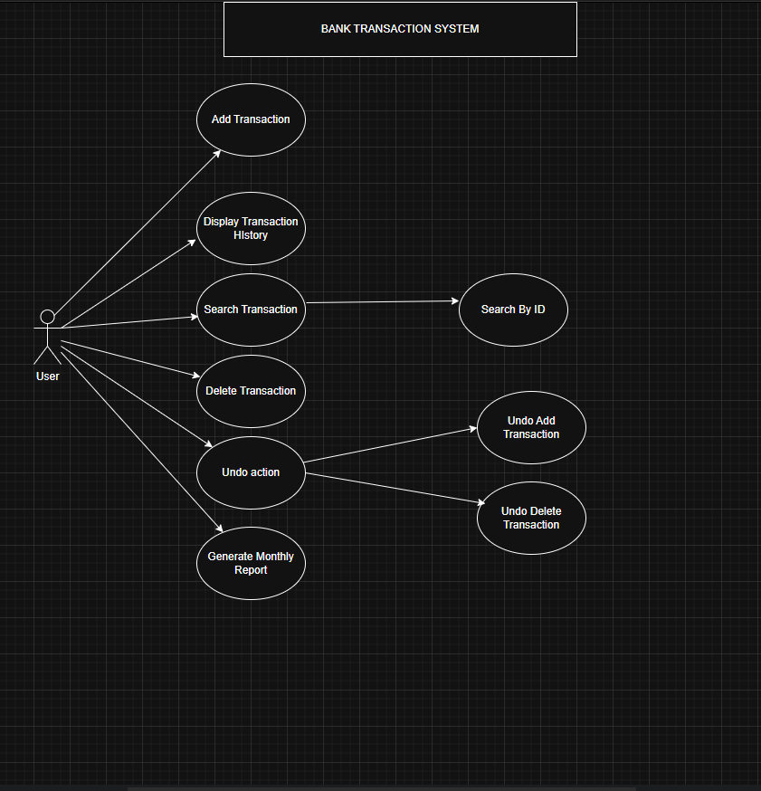
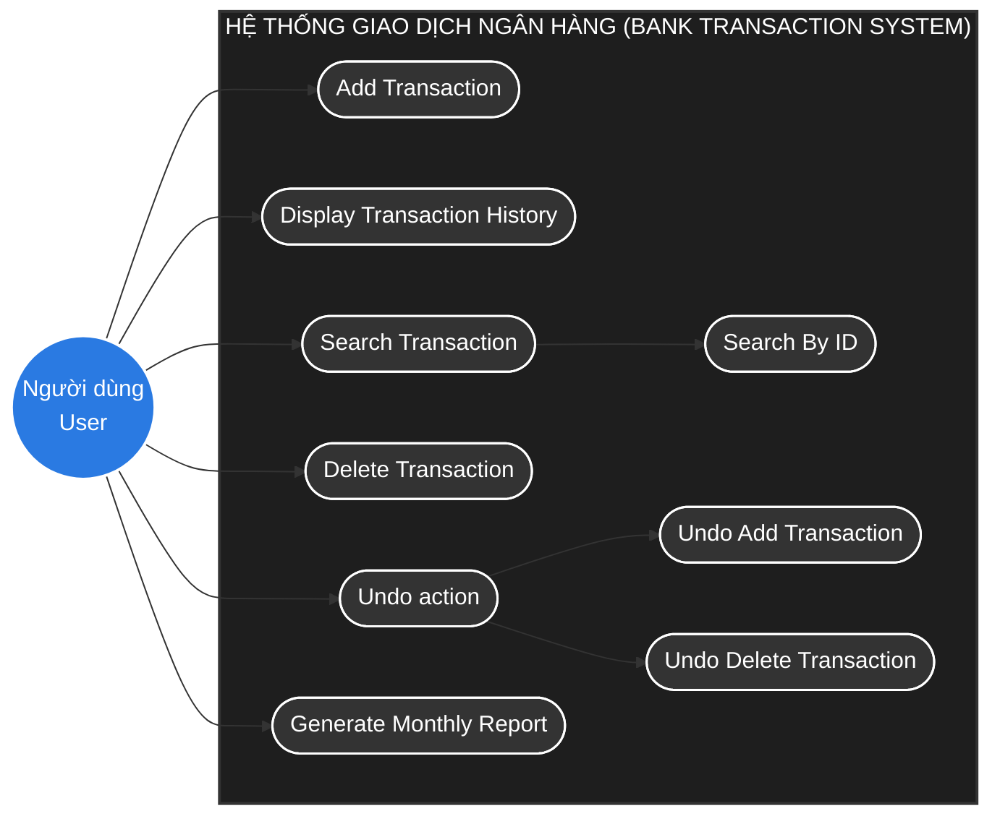

# TÀI LIỆU PHÂN TÍCH USE CASE - HỆ THỐNG GIAO DỊCH NGÂN HÀNG
*(Bank Transaction System)*

Tài liệu này mô tả chi tiết các tác nhân (Actors), các ca sử dụng (Use Cases) và sơ đồ Use Case cho **Hệ thống Giao dịch Ngân hàng (Bank Transaction System)** phục vụ cho môn học **CSD201 - Cấu trúc dữ liệu và giải thuật**.

---

## 1. Xác định các Tác nhân (Actors)

Hệ thống bao gồm 1 tác nhân chính tương tác trực tiếp:

| Tác nhân (Actor) | Mô tả |
| :--- | :--- |
| **Người dùng (User)** | Người sử dụng hệ thống để thực hiện, hiển thị, tìm kiếm, xóa các giao dịch, thực hiện hoàn tác hoặc kết xuất báo cáo thống kê. |

---

## 2. Danh sách các Ca sử dụng (Use Cases)

Dựa trên sơ đồ Use Case thiết kế, các chức năng chính bao gồm:

1. **Add Transaction (Thêm giao dịch)**:
   - Cho phép người dùng thêm một giao dịch mới vào hệ thống.
   - *Cấu trúc dữ liệu liên quan*: Lưu trữ và thêm mới một nút (Node) vào **Singly Linked List** theo thời gian thực ($O(1)$ nếu sử dụng con trỏ Tail).

2. **Display Transaction History (Hiển thị lịch sử giao dịch)**:
   - Hiển thị danh sách các giao dịch đã thực hiện theo trình tự thời gian.
   - *Cấu trúc dữ liệu liên quan*: Duyệt tuyến tính qua các phần tử của danh sách liên kết từ đầu (`Head`) đến cuối (`Tail`).

3. **Search Transaction (Tìm kiếm giao dịch)**:
   - Tìm kiếm giao dịch trong hệ thống.
   - **Search By ID (Tìm kiếm theo ID)**: Ca sử dụng chi tiết giúp tìm kiếm chính xác giao dịch qua Mã giao dịch (ID).
   - *Cấu trúc dữ liệu liên quan*: Áp dụng thuật toán tìm kiếm tuyến tính (Linear Search) trên danh sách liên kết.

4. **Delete Transaction (Xóa giao dịch)**:
   - Cho phép người dùng xóa một giao dịch khỏi lịch sử hệ thống (ví dụ: giao dịch bị lỗi hoặc đối soát).
   - *Cấu trúc dữ liệu liên quan*: Xóa một Node khỏi **Singly Linked List** (cần cập nhật con trỏ của Node đứng trước).

5. **Undo action (Hoàn tác)**:
   - Cho phép khôi phục lại trạng thái trước đó của danh sách giao dịch.
   - **Undo Add Transaction (Hoàn tác việc thêm giao dịch)**: Hủy bỏ giao dịch vừa thêm gần nhất.
   - **Undo Delete Transaction (Hoàn tác việc xóa giao dịch)**: Khôi phục lại giao dịch vừa bị xóa gần nhất.
   - *Cấu trúc dữ liệu liên quan*: Thường áp dụng cấu trúc dữ liệu **Stack** ($O(1)$ cho thao tác Push/Pop) để lưu lịch sử các thao tác nhằm khôi phục trạng thái danh sách liên kết một cách chính xác.

6. **Generate Monthly Report (Tạo báo cáo tháng)**:
   - Kết xuất báo cáo thống kê giao dịch theo tháng.
   - *Cấu trúc dữ liệu liên quan*: Chuyển đổi dữ liệu sang dạng **Mảng (Array)** tĩnh để dễ dàng sắp xếp, tìm kiếm nhị phân (Binary Search) hoặc truy cập trực tiếp bằng chỉ mục phục vụ thống kê số liệu.

---

## 3. Sơ đồ Use Case (Use Case Diagram)

Sơ đồ Use Case trực quan của hệ thống:

Dưới đây là sơ đồ biểu diễn bằng mã Mermaid tương đương với bản vẽ của nhóm:

